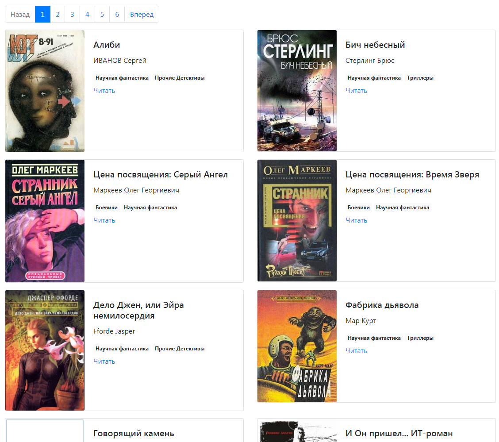

# Парсер книг с сайта [tululu.org](https://tululu.org/)
С помощью этого проекта можно:
* скачать книги с сайта [tululu.org](https://tululu.org/) по номерам страниц книг на сайте.
* скачать книги из коллекции "[Научная фантастика](https://tululu.org/l55/)"
* посмотреть список скачанных книг в виде небольшого статичного сайта, как [здесь](https://petrovskydv.github.io/parse_library/pages/index1.html), и сразу перейти к чтению прямо по ссылке с сайта.

## Как установить
Скачайте проект на свой компьютер. Python3 должен быть уже установлен. 

Затем используйте pip (или pip3, если есть конфликт с Python2) для установки зависимостей:
```
pip install -r requirements.txt
```
## Как использовать
### Скачивание книг по id
Для запуска на компьютере необходимо ввести в командной строке:
```
python parse_tululu.py <start_page> <end_page>
```
`start_page` и `end_page` это обязательные аргументы, которые контролируют с какой по какую страницы сайта скачать.

Ниже пример запуска скрипта, который скачает книги c id начиная с [200](https://tululu.org/b200/) и заканчивая [500](https://tululu.org/b500/):
```
python main.py 200 500
```
Если `start_page` и `end_page` не заданы, то будут загружены книги с id начиная с 1 и заканчивая 1000.

### Скачивание книг из коллекции "[Научная фантастика](https://tululu.org/l55/)"
Для запуска на компьютере необходимо ввести в командной строке:
```
python parse_tululu_category.py
```
У скрипта есть ряд необязательных аргументов:
* `--start_page` - с какой страницы коллекции начинать скачивание. Тип - число. Значение по умолчанию: `1`.
* `--end_page` - по какую страницу коллекции скачивать. Тип - число. Значение по умолчанию `1000`.
* `--skip_imgs` - не скачивать картинки. Если аргумент не указан, то картинки скачиваются.
* `--skip_txt` - не скачивать книги. Если аргумент не указан, то книги скачиваются.
* `--json_path` - путь к *.json файлу с результатами. Тип - строка. Значение по умолчанию: `books.json`.
* `--dest_folder` - путь к каталогу с результатами парсинга: картинкам, книгам, JSON. Тип - строка. По умолчанию результаты сохраняются в папке `media`.

Ниже пример запуска скрипта, который скачает книги из коллекции начиная с [200](https://tululu.org/l55/200) по [210](https://tululu.org/l55/210) страницы, без сохранения картинок.
Все результаты будут сохранены в папку fantastic:
```
python parse_tululu_category.py --start_page 200 --end_page 210 --skip_imgs --dest_folder fantastic

```
### Просмотр скачанных книг
Из скачанных файлов можно сформировать сайт скриптом `render_website.py`.

Пример запуска скрипта, который сформирует сайт используя json файл  `my_books.json` и каталог `my_media` с результатами парсинга:
```
python render_website.py json_path my_books.json dest_folder my_media
```
В результате в папке `pages` сформируются страницы сайта `index1.html`, `index2.html`, `index3.html` и т.д.

Для просмотра сайта нужно скачать на свой компьютер папки `madea`, `static`, `pages`, перейти в папку `pages` и открыть один из `html` файлов, например `index1.html`.

Ниже образец сайта:



По этой [ссылке](https://petrovskydv.github.io/parse_library/pages/index1.html) можно посмотреть этот образец без скачивания.

## Цель проекта
Код написан в образовательных целях на онлайн-курсе для веб-разработчиков [dvmn.org](https://dvmn.org/).

## Лицензия

Этот проект находится под лицензией MIT License - подробности см. в файле LICENSE.